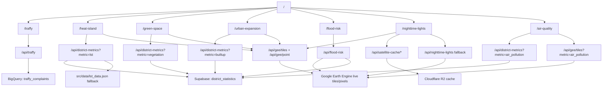
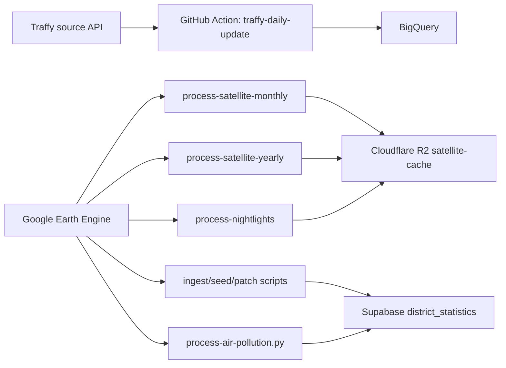

# Bangkok Analytics App Workflow

เอกสารนี้สรุป workflow ปัจจุบันของแอพหลังจัดชื่อให้ตรงกับหน้าที่จริงของแต่ละส่วน

## Runtime Dashboard Flow



## Naming Rules

| Concern | Current name to use | Legacy / specific name | Notes |
| --- | --- | --- | --- |
| District metric API | `/api/district-metrics` | `/api/lst` | `/api/lst` remains as a compatibility alias. New code should call `/api/district-metrics`. |
| Shared satellite map component | `DistrictMetricsMapView` | `LSTMapView` | The map renders heat, green space, built-up, and nightlights views. |
| LST-specific sidebar | `LSTSidebar` | - | Keep this name because it is only for `/heat-island`. |
| District statistics table | `district_statistics` | - | Shared table for LST, NDVI, NDBI, water, and nightlights metrics. |

## Module Responsibilities

### `/traffy`

Interactive complaint dashboard. It reads from BigQuery through `/api/traffy`, then renders point or heatmap layers in `MapView`.

### `/heat-island`

LST dashboard. It reads district summaries through `/api/district-metrics` and renders live GEE raster/pixel inspection through `DistrictMetricsMapView`.

### `/green-space`

NDVI and green-space dashboard. It uses `/api/district-metrics?metric=vegetation`, then derives KPIs such as green area ratio, green area rai, and low-green priority ranking.

### `/urban-expansion`

Built-up/NDBI dashboard. It uses `/api/district-metrics?metric=builtup` and shares the same map workflow as heat and green-space analysis.

### `/flood-risk`

Water and flood-risk dashboard. It has a dedicated `/api/flood-risk` because it can compute live Sentinel-2 NDWI/MNDWI district stats and combine them with cache data.

### `/nighttime-lights`

VIIRS dashboard. It prefers Cloudflare R2 cache metadata through `/api/satellite-cache/*`; if cache stats are missing it falls back to `/api/nighttime-lights`.

### `/air-quality`

Satellite air pollution proxy dashboard. It reads yearly district summaries from `district_statistics` via `/api/district-metrics?metric=air_pollution`, while the map raster is loaded live from GEE Sentinel-5P through `/api/gee/tiles?metric=air_pollution`. This module is not ground-station AQI.

Runtime proof points:

- `/api/district-metrics?metric=air_pollution&year=2024` must return `summary.dataSource = "supabase district_statistics"` and 50 GeoJSON features with `no2_mean`.
- `/api/gee/tiles?metric=air_pollution&year=2026&pollutant=no2` must return an Earth Engine `urlFormat`.
- `/air-quality` should show Average, Highest, and Ranking after the first fetch finishes.

## Data Preparation Flow



## Colab Status

`colab/bkk_gee_pipeline.ipynb` is a manual GEE to Supabase notebook. It is not called by the Next.js app or GitHub Actions. Current automated workflows use scripts under `scripts/` and `.github/workflows/`.

## Agent Handoff: Air Pollution

Use this section first when another agent resumes the air-pollution work.

What exists:

- UI page: `src/app/air-quality/page.tsx`
- Shared API: `src/app/api/district-metrics/route.ts` with `metric=air_pollution`
- GEE raster APIs: `src/app/api/gee/tiles/route.ts` and `src/app/api/gee/point/route.ts`
- Map renderer: `src/components/gee/DistrictMetricsMapView.tsx` with `analysisType="air"`
- Supabase columns: `supabase/migrations/008_add_air_pollution_columns.sql`
- Upsert key guard: `supabase/migrations/009_ensure_district_statistics_unique_year.sql`
- Data pipeline: `scripts/gee/process-air-pollution.py`
- Env helper: `scripts/gee/run-air-pollution.mjs`

Required env:

- `GEE_SERVICE_ACCOUNT_JSON` or `GEE_CLIENT_EMAIL` + `GEE_PRIVATE_KEY` + `GEE_PROJECT_ID`
- `SUPABASE_URL` or `NEXT_PUBLIC_SUPABASE_URL`
- `SUPABASE_SERVICE_KEY` or `SUPABASE_SERVICE_ROLE_KEY`

Run pipeline:

```bash
npm run gee:air-pollution -- --year 2024
npm run gee:air-pollution -- --years 2019-2026
```

If Python is not on PATH, set `PYTHON_BIN` to the Python executable with `scripts/gee/requirements.txt` installed.

Quick verification:

```bash
npm run build
curl "http://localhost:3010/api/district-metrics?metric=air_pollution&year=2024"
curl "http://localhost:3010/api/gee/tiles?metric=air_pollution&year=2026&pollutant=no2"
```

Production Supabase currently has Sentinel-5P yearly district rows for 2019-2026, 50 districts per year. The 2026 row range is year-to-date through 2026-05-09.
